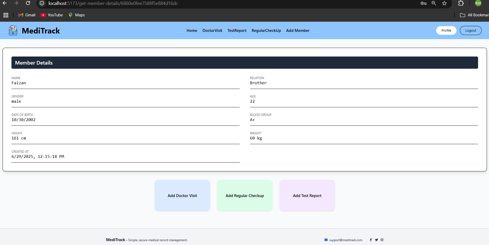
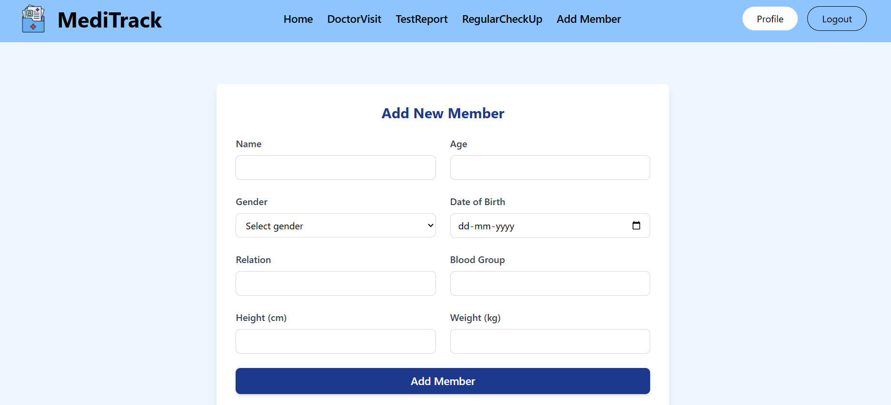
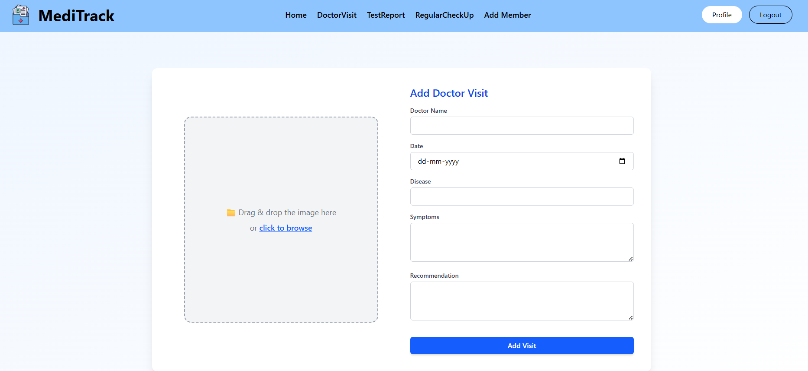
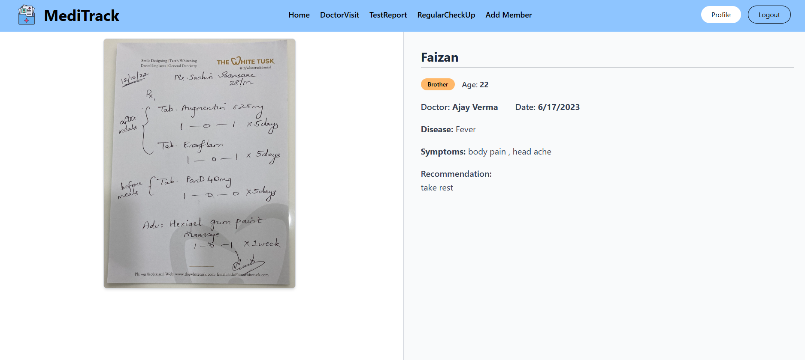
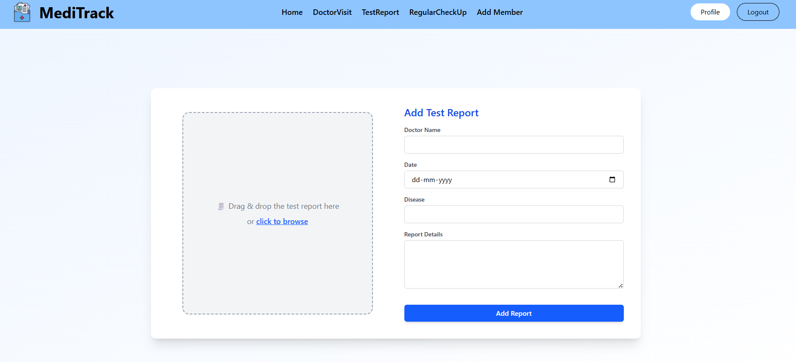
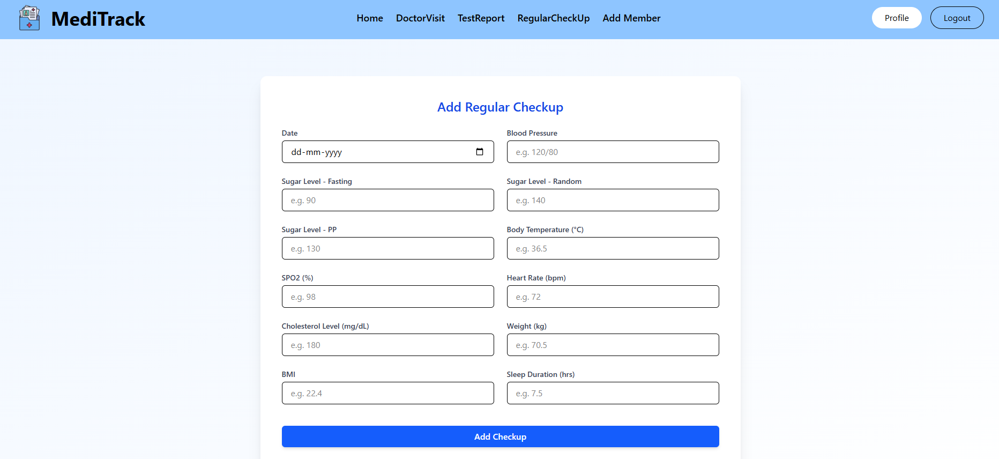
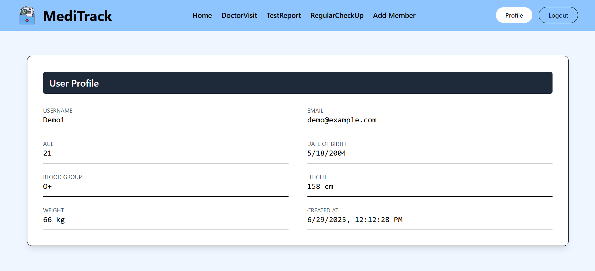

# 🩺 MediTrack – Healthcare Record Management System

**MediTrack** is a full-stack MERN (MongoDB, Express.js, React.js, Node.js) web application designed to securely store, manage, and access the medical records of your family and friends. Whether it's a doctor visit, a test report, or a regular health checkup — MediTrack keeps everything organized in one place.

---

## 🚀 Features

- 👨‍👩‍👧‍👦 Add and manage member profiles
- 🧾 Record doctor visit details
- 📋 Track regular checkups
- 📑 Upload and view test reports
- 🔐 Secure and centralized access to health data

---

## 🛠️ Tech Stack

| Layer    | Technology          |
|----------|---------------------|
| Frontend | React.js            |
| Backend  | Node.js, Express.js |
| Database | MongoDB             |

---

## 📷 Screenshots

### 🏠 Homepage  
**Description:**  
The landing page of MediTrack. It provides a clean and welcoming introduction with navigation options to access members, visits, checkups, and reports.

---

### 👥 Member List  
**Description:**  
Displays all the added member profiles. Each card summarizes the member and allows access to detailed records.

---

### 👤 Member Details  
**Description:**  
Detailed profile of a selected member. Shows their doctor visits, test reports, and checkup history.

---

### ➕ Add New Member  
**Description:**  
A form interface to add a new family member or friend. Includes fields like name, age, gender, and relation.

---

### 🩺 Add Doctor Visit  
**Description:**  
Allows users to record doctor visits including date, doctor name, diagnosis, prescription, and notes.

---

### 📝 Doctor Visit Log  
**Description:**  
Shows the history of all doctor visits associated with a specific member.

---

### 🧪 Add Test Report  
**Description:**  
Upload test reports including test name, date, and report file (PDF or image).

---

### 📅 Add Regular Checkup  
**Description:**  
Form to track regular health checkups such as BP, sugar level, or any other routine metrics.

---

### 🙍‍♂️ Profile Page  
**Description:**  
User profile page that shows account details and basic stats like number of members, visits, etc.

---

